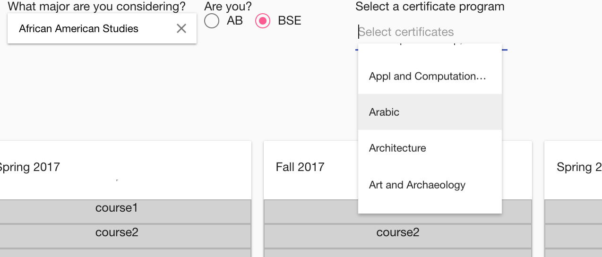

# 4-years-of-fun
This is a  productivity tool for Princeton University students to help them visualize their long term academic career

When it comes to course and academic path selection, Princeton students are given unbelievable freedom and many courses to
choose from. 
Every student often finds themselves wandering in dozens of websites of different academic programs and  doing extensive reaserch
in order to find certificate programs which work well with their major.

###This project comes to cure this pain!

It allows to choose a major and a  couple of certificates from the available list, and explore different courses  and course combinations
using only one website instead of <code>Log(M) + 8 * N</code> where <code>M</code> is the number of Majors availble and <code>N</code>
is number of certificate programs.
#AngularMaterial

<div style="height:40px"></div>
#Data-integrated

#Drag&Drop


#Deployment

```shell
git clone https://github.com/Ngalstyan4/4-years-of-fun.git
bower install
npm install
node server.js
```
